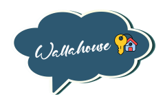

<div align="center">

</div>
  
<h1 align="center">Project: "Marketplace"</h1>

<h2>1. Project description:</h2>
<ul>
<li>The project consists of users who are looking for an economical and alternative short-term vacation rental to find through Wallahouse a marketplace that shows properties that clients wish to publish their properties for exchange or short-term rental</li>
</ul>

<h2>2. User stories:</h2>

<h3>2.1 User Story (User):</h3>
<ul>
<li>See the page.</li>
<li>They can see a list short-term vacation rental home .</li>
<li>They can see their information.</li>
</ul>

<h3>2.2 User Story (Client):</h3>
<ul>
<li>clients can to publish their properties for exchange or short-term rental.</li>
<li>clients can see their properties for exchange or short-term rental in Home View.</li>
</ul>

## 3. Team Members

| Name | Role | |
| :--- | :---: | :---: |
| Manu |  Scrum Master | https://github.com/ManuKovacicSG |
| Carmen Trillo | Product Owner | https://github.com/Carmen-Trillo |
| Ignacio  | Developer | https://github.com/Uriens |
| Himorell Jaramillo | Developer | https://github.com/Himorell |
| Adria Gomez| Developer| https://github.com/adria15gomez|
| Gabriel | Developer | https://github.com/GabriMF |
| Andrea | Developer| https://github.com/CodeMincer|


<h2>4. Atomic Design</h2> 
<div style="display:flex; flex-wrap:wrap; justify-content:center; margin:auto">

</div>

<h2>5. Final Design</h2> 
<div style="heigth:auto; display:flex; flex-wrap:wrap; justify-content:center; padding:1rem">

| Login |  Home View |  Client View |  User Show View | User View |
| --- | --- | --- | --- | --- |
|  |  |  |   |  |

</div>


<h2>6. Stacks</h2>
<ul>
<li>HTML5</li>
<li>CSS3</li>
<li>JavaScript</li>
<li>React</li>
<li>PHP 8.1.10</li>
<li>Laravel</li>
<li>Boostrap 5</li>
</ul>

<h2>7. Required:</h2>
<li>Composer & Laravel Installed</li>
<li>XAMPP/LAMPP Installed</li>
<li>NPM Installed</li>
<li>MySQL</li>
<li>PHP</li>
<li>PHP Artisan Serve</li>

<h2>8. How to install this project:</h2>

You will need a text editor and perform the following steps:

1. Clone the project
```bash
  git clone https://github.com/Himorell/wallahouseFront
```

2. Go to the project directory
```bash
  cd wallahousefront
```

3. Create a MySQL database named "wallahousefront"

4. Locate .env.example in the project and once there change the database name that comes by default for our database name (laravel for wallahousefront). After that, remove .example from the file name so its new name will be .env

5. Install dependencies
```bash
  npm install
```
```bash
  composer install
```

6. Activate the server and keep this terminal open
```bash
  npm run dev
```

7. Run the PHP server and keep this terminal open
```bash
  php artisan serve
```

8. Import database
```bash
  php artisan migrate:fresh --seed
```

***

 <h2>9. Tests</h2>

To run the php tests, execute the following command(s)
```bash
  php artisan test
```


To run the vendor tests, execute the following command(s)
```bash
  vendor/bin/phpunit
```


<h2>10. Methodology:</h2>
<ul>
<li>Mob programming.</li>
<li>Pair programming.</li>
<li>Agile with SCRUM</li>
<li>TDD</li>
</ul>


<h2>11. Next Steps</h2>
<ul>
<li>.</li>
<li></li>
<li</li>
<li></li>
<li>Test.</li>
<li></li>
<li></li>
<li></li>

</ul> 

